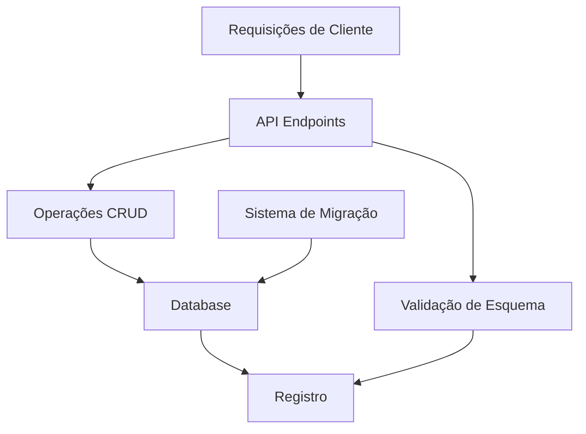
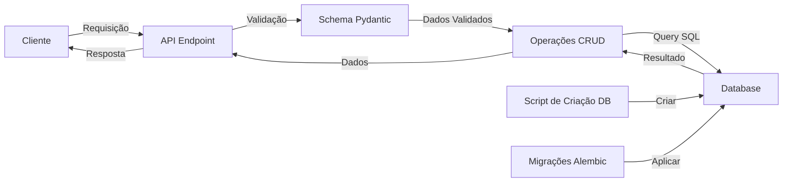
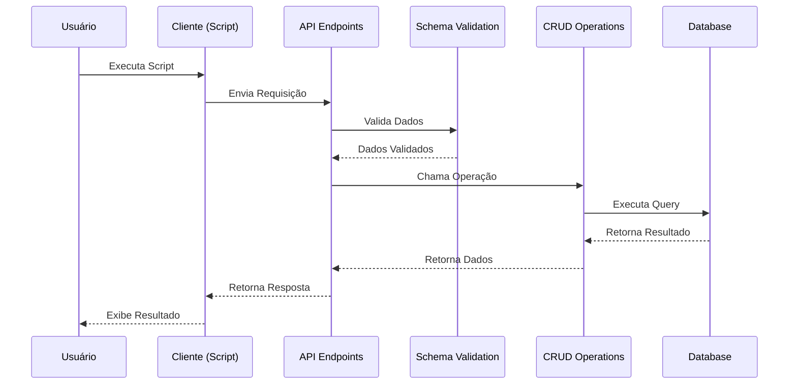

# Documentação Técnica da API USP Graduação

## Resumo do Projeto

A API USP Graduação é uma API REST desenvolvida com FastAPI que permite gerenciar registros relacionados a imóveis em diferentes áreas de cidades. O sistema utiliza PostgreSQL como banco de dados, SQLAlchemy como ORM (Object-Relational Mapping) e Alembic para migrações de banco de dados. A API oferece endpoints para criar, ler, buscar e deletar registros, com validação de dados através do Pydantic.

## Abstrações Principais

1. [**Registro**](01_registro.md) - Entidade principal que representa os dados de imóveis/áreas
2. [**Database**](02_database.md) - Camada de acesso ao banco de dados PostgreSQL
3. [**API Endpoints**](03_api_endpoints.md) - Interface REST para manipulação dos registros
4. [**Operações CRUD**](04_operacoes_crud.md) - Operações de banco de dados para gerenciar registros
5. [**Validação de Esquema**](05_validacao_esquema.md) - Validação de dados com Pydantic
6. [**Sistema de Migração**](06_sistema_migracao.md) - Sistema de migração de banco de dados com Alembic
7. [**Requisições de Cliente**](07_requisicoes_cliente.md) - Scripts para interação com a API

## Diagramas de Arquitetura

### Diagrama de Relacionamento de Abstrações

### Diagrama de Fluxo da Aplicação

### Diagrama de Sequência

## Índice da Documentação

- [Registro](01_registro.md)
- [Database](02_database.md)
- [API Endpoints](03_api_endpoints.md)
- [Operações CRUD](04_operacoes_crud.md)
- [Validação de Esquema](05_validacao_esquema.md)
- [Sistema de Migração](06_sistema_migracao.md)
- [Requisições de Cliente](07_requisicoes_cliente.md)